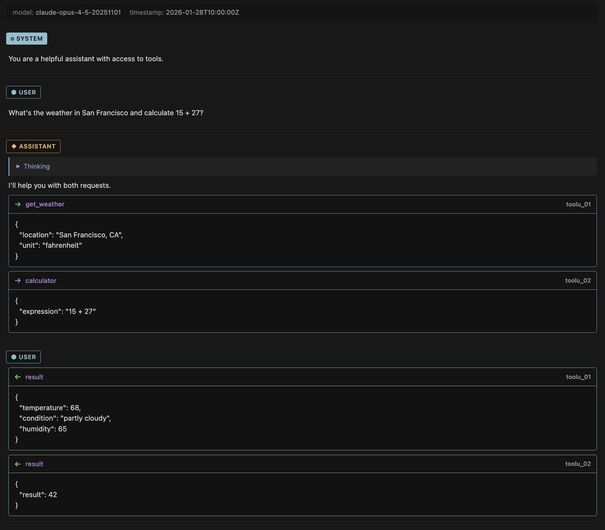

# LLMC File Viewer

View and edit `.llmc` files — a markdown-based format for LLM conversations with **thinking tokens** and **tool calls**.

Supports **DeepSeek R1**, **Qwen/QwQ**, and **Claude** formats.

## Preview



## Features

- **Syntax Highlighting** — Role headers, thinking blocks, tool calls, markdown
- **Live Preview** — `Ctrl+Shift+P` → "LLMC: Open Preview"
- **Collapsible Thinking** — Expand/collapse reasoning blocks
- **Tool Call Display** — Shows tool names, IDs, and formatted JSON
- **Theme Support** — Adapts to VS Code dark/light themes

## Quick Example

```markdown
---
model: claude-opus-4-5
---

## user
What's 15 + 27?

## assistant

<think>
Simple addition: 15 + 27 = 42
</think>

The answer is **42**.

<tool_use id="calc_01" name="calculator">
{"expression": "15 + 27"}
</tool_use>

## user

<tool_result id="calc_01">
{"result": 42}
</tool_result>
```

## Supported Formats

| Provider | Thinking Tags | Status |
|----------|---------------|--------|
| DeepSeek R1 | `<think>...</think>` | ✓ |
| Qwen/QwQ | `<think>...</think>` | ✓ |
| Claude | `<thinking>...</thinking>` | ✓ |

## Commands

| Command | Description |
|---------|-------------|
| `LLMC: Open Preview` | Side-by-side rendered preview |

## Links

- [GitHub Repository](https://github.com/ajay-sreeram/llmc-format)
- Python library: `pip install llmc-format`
